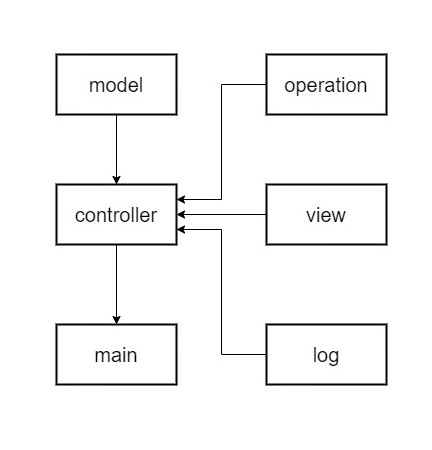

## _**Задача**_

Создать калькулятор для работы с рациональными и комплексными числами, организовать меню, добавив в нее систему логирования и обработку некорректного ввода данных.

_**Разработчик**_: Большакова Ольга

_**Архитектура**_ данного калькулятора состоит из 6 модулей:
- *model* - модуль, содержащий функции суммы, разности, произведения и частного чисел;
- *view* - модуль для взаимодействия с пользователем, позволяет выводить данные на экран;
- *controller* - в данном модуле осуществляется запуск калькулятора;
- *main* - в данном модуле производится запуск всей программы;
- *log* - логирование:
    - дата
    - время
    - операция
    - входные данные
    - результат вычислений;
- *operation* - модуль, работающий с вводимой строкой - разбивает ее на числа и считывает операцию, которую необходимо выполнить. Данный модуль позволяет работать как с рациональными, так и с комплексными числами. НО! Результат вычисляется лишь если данные вводятся через пробел!

Данный калькулятор может выполнять такие операции, как сложение, вычитание, умножение и деление.  

